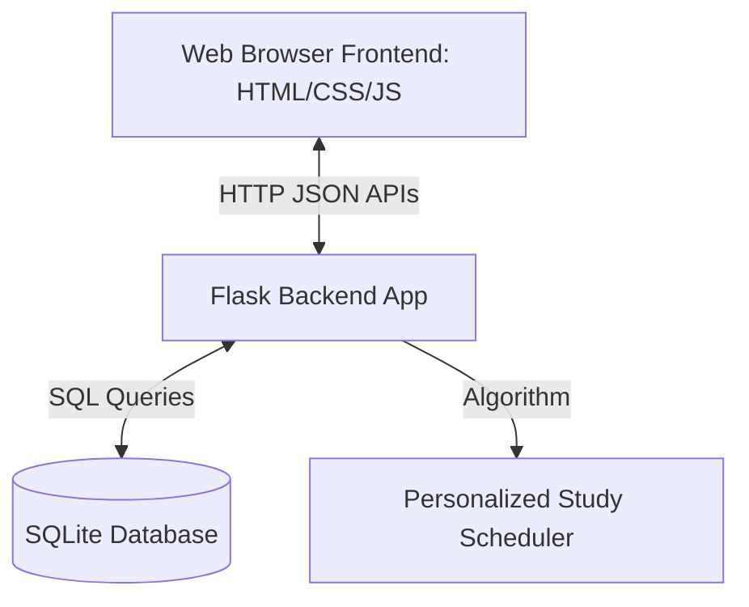
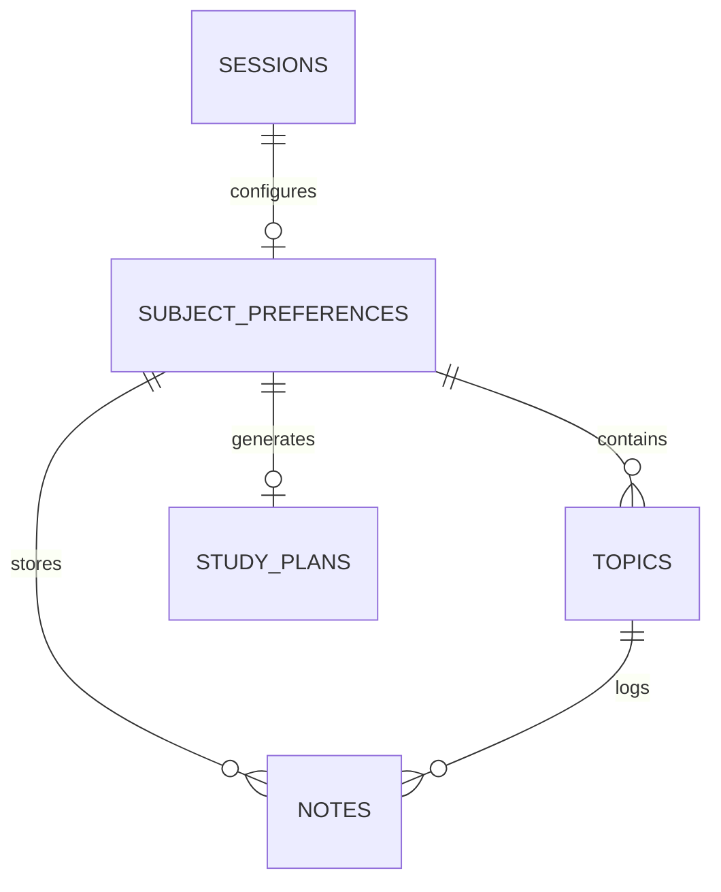
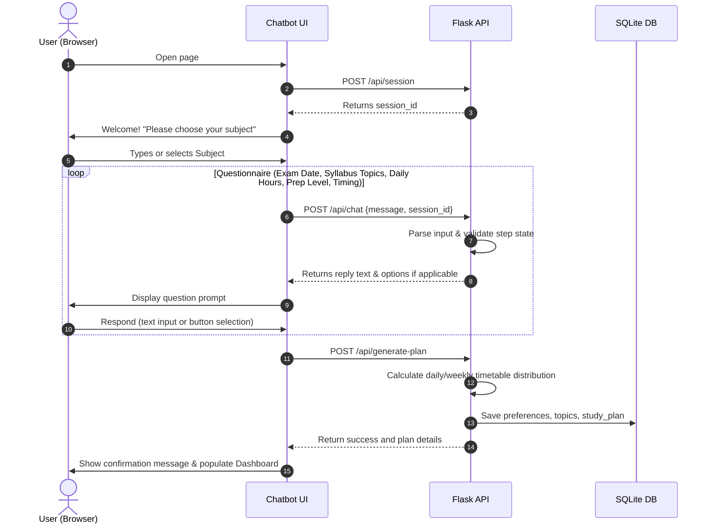

# Student Academic Companion Chatbot - Implementation Plan

This document outlines the architectural design, directory structure, data models, API endpoints, flowcharts, validation strategies, and future scalability plans for the **Student Academic Companion Chatbot**.

---

## 1. Overall Architecture

The chatbot is built using a **Client-Server Architecture** designed for lightweight deployment and high responsiveness:

* **Presentation Layer (Frontend)**: A responsive Single Page Application (SPA) utilizing HTML5, vanilla CSS3 (utilizing modern styling, variables, glassmorphism, and transitions), and Vanilla JavaScript. It communicates asynchronously with the backend using the Fetch API.
* **Application Layer (Backend)**: A Python Flask web server hosting RESTful APIs, managing session states, running the study scheduler algorithm, and interacting with the database.
* **Data Layer (Database)**: An SQLite database serving as a persistent, file-based relational store for questionnaire inputs, generated schedules, notes, and study resources.



---

## 2. Folder Structure

The project directory will follow a modular, organized layout:

```
AI chatbot/
├── app.py                  # Main Flask entrypoint & API routes
├── config.py               # Flask & Database configurations
├── database.py             # SQLite connection wrapper & lifecycle helper
├── schema.sql              # Database schema definition
├── scheduler.py            # Study plan generation business logic
├── requirements.txt        # Python dependency manifest
├── plan.md                 # Technical design plan (PR #1)
├── phases.md               # Phase-wise development roadmap (PR #2)
├── static/
│   ├── css/
│   │   └── style.css       # Premium CSS styles (design system, variables, dark mode)
│   └── js/
│       └── chat.js         # Frontend router, Chat interface logic, and API calls
└── templates/
    └── index.html          # Main HTML structure for the SPA
```

---

## 3. Backend Architecture

The Flask backend is structured to be modular and state-conscious:
* **Session Management**: Uses an HTTP-only browser cookie or custom request header containing a unique `session_id` (generated as a UUID v4) to track the step-by-step progression of the questionnaire.
* **Database Connection Manager**: Manages connection lifecycles, ensuring connections are closed at the end of each request using Flask's `@app.teardown_appcontext`.
* **Timetable Scheduler Engine**: A stateless module that consumes user parameters (dates, hours, preparation level, timing preferences, topics) and computes study slots, review periods, and rest days.

---

## 4. Frontend Architecture

The frontend is a premium, single-page application dashboard designed for a modern user experience:
* **Chat Panel**: A persistent conversational sidebar interface where users interact with the chatbot, answer the questionnaire, and receive tips.
* **Dashboard Panel**: A dynamic grid-based interface that shifts and populates in real-time as the study plan is generated, featuring:
  - **Countdown Widget**: Days remaining until the exam.
  - **Daily Schedule View**: Detailed list of tasks to complete today.
  - **Weekly Timetable View**: Calendar-like visualization of weekly study targets.
  - **Notes & Resource Manager**: Quick tools to log notes and external links next to active topics.
* **Styling**: Curated color palette (dark theme with deep charcoal background, neon cyan/teal accents, and soft glassmorphism card overlays) to wow the student.

---

## 5. SQLite Database Schema

The database model tracks student preferences, topics, schedules, and supplementary notes.



### Table Definitions

#### `sessions`
Tracks anonymous or named client sessions.
* `session_id` (TEXT PRIMARY KEY) - UUID generated by frontend or backend.
* `created_at` (TIMESTAMP DEFAULT CURRENT_TIMESTAMP)

#### `subject_preferences`
Stores parameters collected during the questionnaire.
* `id` (INTEGER PRIMARY KEY AUTOINCREMENT)
* `session_id` (TEXT FOREIGN KEY REFERENCES `sessions(session_id)`)
* `subject_name` (TEXT)
* `exam_date` (DATE)
* `daily_hours` (REAL)
* `prep_level` (TEXT) - `'beginner'`, `'intermediate'`, or `'advanced'`
* `study_timing` (TEXT) - `'morning'`, `'afternoon'`, `'evening'`, or `'night'`
* `created_at` (TIMESTAMP DEFAULT CURRENT_TIMESTAMP)

#### `topics`
Stores the individual syllabus components/topics.
* `id` (INTEGER PRIMARY KEY AUTOINCREMENT)
* `preference_id` (INTEGER FOREIGN KEY REFERENCES `subject_preferences(id)`)
* `topic_name` (TEXT)
* `status` (TEXT DEFAULT 'pending') - `'pending'`, `'in_progress'`, or `'completed'`
* `created_at` (TIMESTAMP DEFAULT CURRENT_TIMESTAMP)

#### `study_plans`
Stores the generated schedule outputs.
* `id` (INTEGER PRIMARY KEY AUTOINCREMENT)
* `preference_id` (INTEGER FOREIGN KEY REFERENCES `subject_preferences(id)`)
* `plan_data` (TEXT) - Serialized JSON string containing the daily and weekly schedule breakdown
* `created_at` (TIMESTAMP DEFAULT CURRENT_TIMESTAMP)

#### `notes`
Stores study notes and resource web links.
* `id` (INTEGER PRIMARY KEY AUTOINCREMENT)
* `preference_id` (INTEGER FOREIGN KEY REFERENCES `subject_preferences(id)`)
* `topic_id` (INTEGER FOREIGN KEY REFERENCES `topics(id)` NULLABLE)
* `note_title` (TEXT)
* `note_content` (TEXT)
* `resource_url` (TEXT)
* `created_at` (TIMESTAMP DEFAULT CURRENT_TIMESTAMP)

#### `motivational_tips`
A seed table containing motivational reminders.
* `id` (INTEGER PRIMARY KEY AUTOINCREMENT)
* `tip_text` (TEXT)
* `category` (TEXT)

---

## 6. API Endpoints

| Method | Endpoint | Description | Request Body (JSON) / Params | Response (JSON) |
|---|---|---|---|---|
| `POST` | `/api/session` | Start a new chatbot session | None | `{ "session_id": "uuid" }` |
| `POST` | `/api/chat` | Send user message to process questionnaire step | `{ "session_id": "uuid", "message": "text" }` | `{ "reply": "text", "step": "field_name", "options": [] }` |
| `POST` | `/api/generate-plan` | Submit questionnaire answers & trigger plan creation | `{ "session_id": "uuid", "subject_name": "text", "exam_date": "YYYY-MM-DD", "topics": ["topic1", "topic2"], "daily_hours": 4.0, "prep_level": "intermediate", "study_timing": "morning" }` | `{ "success": true, "plan": { "daily": [], "weekly": [] } }` |
| `GET` | `/api/plan` | Fetch current study plan | Query params: `session_id=uuid` | `{ "plan": { "daily": [], "weekly": [] }, "preferences": {} }` |
| `GET` | `/api/notes` | Get all notes/resources for current session | Query params: `session_id=uuid` | `{ "notes": [...] }` |
| `POST` | `/api/notes` | Create a new study note or link | `{ "session_id": "uuid", "topic_id": int, "title": "text", "content": "text", "resource_url": "url" }` | `{ "success": true, "note": {...} }` |
| `DELETE`| `/api/notes/<id>` | Delete a specific note | None | `{ "success": true }` |
| `GET` | `/api/tips` | Fetch a random motivational tip | None | `{ "tip": "text" }` |

---

## 7. Application Flow



---

## 8. Data Flow

1. **Input Capture**: User inputs parameters on the frontend chat container.
2. **Payload Serialization**: JSON payloads containing `session_id` and values are dispatched to Flask backend.
3. **Validation & State Check**: Backend checks variables. If validation fails, an error response is returned prompting the user to re-submit correct values.
4. **Schedule Computations**:
   - The scheduler calculates the total days available `D = exam_date - current_date`.
   - The scheduler divides total topics `T` across available days.
   - Adjusts daily milestones based on `daily_hours` and `prep_level` (e.g., adding regular review milestones or buffer days if preparation is 'beginner').
   - Filters study schedules by preferred `study_timing` window.
5. **Persistence**: Plan components are saved to the database.
6. **Rendering**: The backend returns the full structured schedule in JSON, and Javascript dynamically populates the Dashboard layouts using DOM manipulation.

---

## 10. Development Strategy

We will use a branch-based development cycle mapping directly to the phases described in `phases.md`:
* **Branch `pr-1-implementation-plan`**: Write and review the core system documentation.
* **Branch `pr-2-phases-roadmap`**: Write and review the phase-wise development roadmap.
* **Branch `feature/foundation`**: Implement SQLite schema, Flask core, folder structure, and basic layout.
* **Branch `feature/core-chatbot`**: Implement the chatbot questionnaire, database logic, and scheduler engine.
* **Branch `feature/additional-features`**: Implement resource manager, styling animations, and input validations.
* **Branch `feature/testing-cleanup`**: Write tests, clean up logs, optimize queries, and run final verifications.

---

## 11. Dependencies

All Python dependencies will be listed in `requirements.txt`:
* **Flask (>= 3.0.0)** - Core backend web server framework.
* **Werkzeug (>= 3.0.0)** - WSGI utility library used by Flask.
* *Standard Library Packages* (no extra installations required):
  - `sqlite3` - Database driver.
  - `datetime` - Time & date calculations.
  - `uuid` - Session identifier generator.
  - `json` - Data serialization.
  - `math` - Calculation utility for schedule division.

---

## 12. Error Handling

A robust system requires proper exception catching at both ends:
* **Backend Error Catching**:
  - All REST endpoints are wrapped in `try...except` blocks.
  - Returns a standard JSON payload: `{ "error": "User-friendly description" }` with appropriate status codes (e.g., 400 Bad Request, 500 Internal Server Error).
  - Handles SQLite transaction rollbacks automatically if queries fail.
* **Frontend Error Catching**:
  - Handles fetch network failures gracefully by displaying an alert inside the chat panel: "Connection lost. Please try again."
  - Displays input validation errors directly above the input fields.

---

## 13. Validation Strategy

* **Exam Date**: Must be a valid date in the format `YYYY-MM-DD` and must be at least 1 day in the future.
* **Daily Hours**: Must be a decimal/float between `0.5` and `16.0` hours inclusive.
* **Syllabus Topics**: Must be non-empty and input as a list of distinct strings. Capped at 50 topics for the MVP.
* **Preparation Level**: Enforced against set options: `beginner`, `intermediate`, or `advanced`.
* **Study Timing**: Enforced against set options: `morning`, `afternoon`, `evening`, or `night`.

---

## 14. Future Scalability

* **Multi-Subject Expansion**: Extend the `subject_preferences` table to support a `subject_id` and allow scheduling multiple subjects by introducing priority weights and interleaved calendar slots.
* **User Authentication**: Add a `users` table (`username`, `password_hash`, `email`) and JWT tokens / Flask-Login to support persistent account synchronization.
* **AI Integration**: Replace or augment the questionnaire parsing and tips with a modern AI API (e.g. Gemini API) for conversational scheduling, custom learning advice, and doubt-solving.
